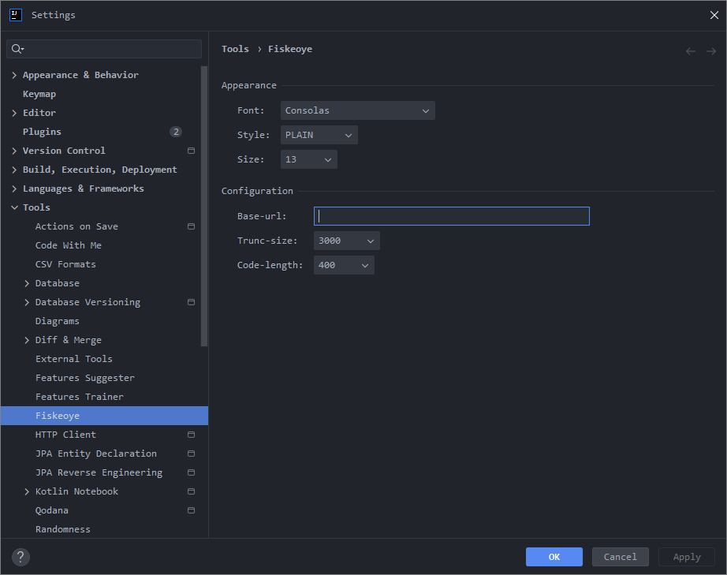
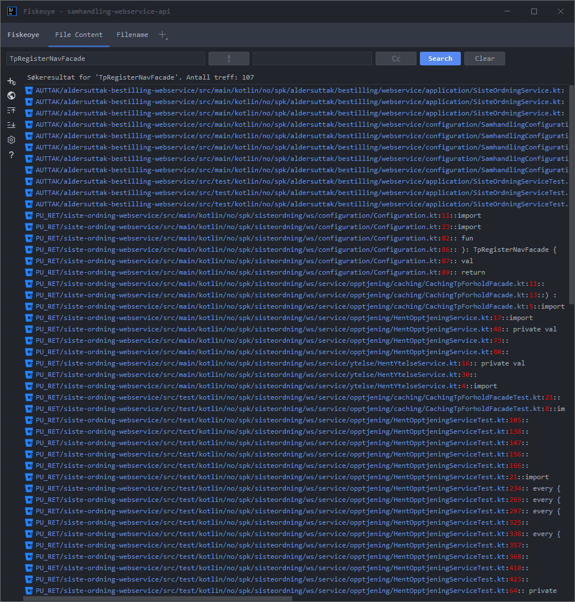

#  Fiskeoye

<!-- Plugin description -->
Simple intellij plugin that wraps the features found in fiskeoye. The plugin was developed as part of skipit at Statens Pensjonskasse.
<!-- Plugin description end -->

## Build

Clone the project

```
git clone https://github.com/statens-pensjonskasse/fiskeoye-plugin.git
```

Build the plugin using gradle wrapper

```
./gradlew clean buildPlugin
```

Locate the zip

```
cd build/distributions/
ls
fiskeoye-plugin-0.0.1.zip
```

## Installation

- Using IDE built-in plugin system:

  <kbd>Settings/Preferences</kbd> > <kbd>Plugins</kbd> > <kbd>Marketplace</kbd> > <kbd>Search for "Fiskeoye"</kbd> >
  <kbd>Install Plugin</kbd>

- Manually:

  Download the [latest release](https://github.com/statens-pensjonskasse/fiskeoye-plugin/releases/latest) and install it manually using
  <kbd>Settings/Preferences</kbd> > <kbd>Plugins</kbd> > <kbd>⚙️</kbd> > <kbd>Install plugin from disk...</kbd>

## Usage

Before using the fiskeoye-plugin, we must configure the `base-url` (starting with `https://`) for fiskeoye using
<kbd>Settings</kbd> > <kbd>Tools</kbd> > <kbd>Fiskeoye</kbd> > <kbd>Base-url</kbd>



In order to use the plugin select a piece of code, right click (or use the context menu button) then use <kbd>Fiskeoye</kbd> > <kbd>Search with File Content / File Name</kbd> 


This will result in the fiskeoye window being open (Shortcut `ALT` + `F10`), press `Enter` or click `Search`.



Double-click item in the list will result in default browser being open with the result.

## License

[MIT](https://choosealicense.com/licenses/mit/)

---
Plugin based on the [IntelliJ Platform Plugin Template][template].

[template]: https://github.com/JetBrains/intellij-platform-plugin-template
